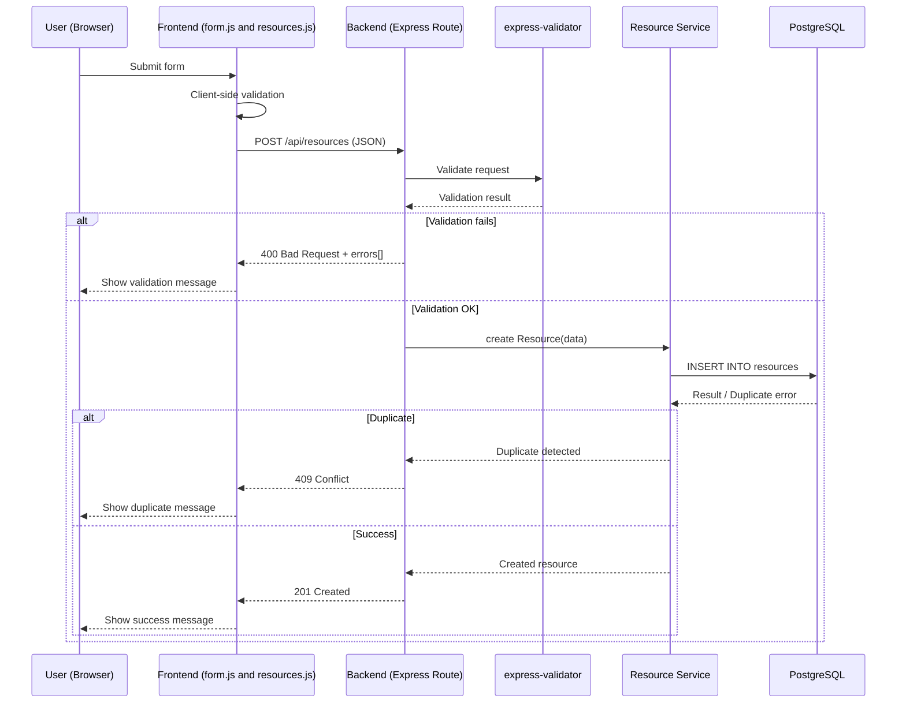
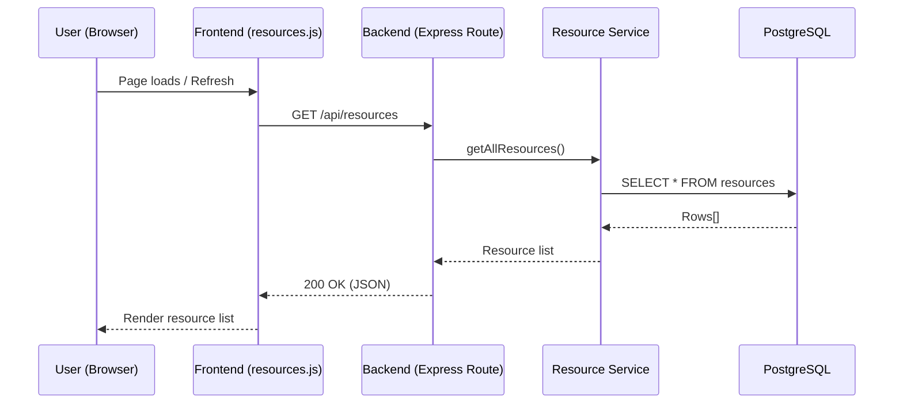
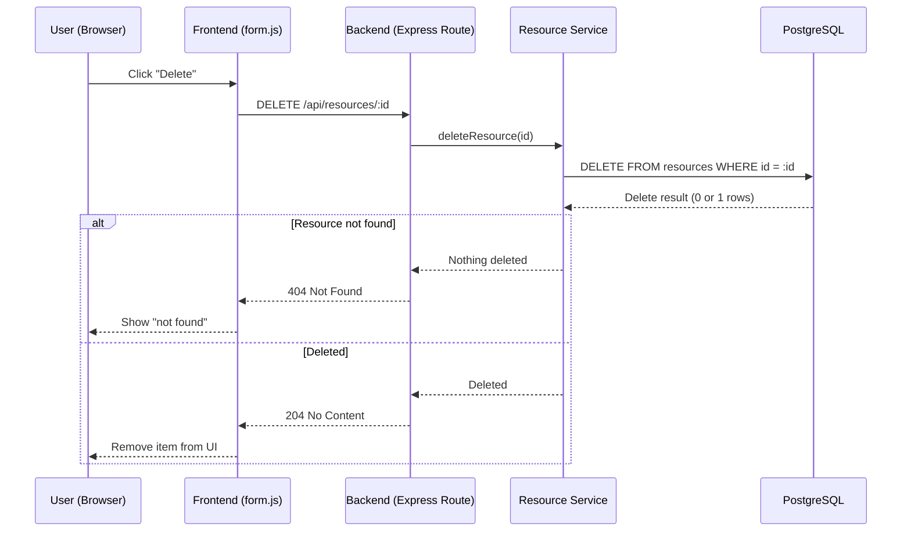

CREATE

READ



UPDATE
```mermaid
sequenceDiagram
    sequenceDiagram
    participant U as User (Browser)
    participant F as Frontend (form.js)
    participant B as Backend (Express Route)
    participant V as express-validator
    participant S as Resource Service
    participant DB as PostgreSQL

    U->>F: Submit edit form
    F->>B: PUT /api/resources/:id (JSON)

    B->>V: Validate request
    V-->>B: Validation result

    alt Validation fails
        B-->>F: 400 Bad Request + errors[]
        F-->>U: Show validation message
    else Validation OK
        B->>S: updateResource(id, data)
        S->>DB: UPDATE resources SET ... WHERE id = :id
        DB-->>S: Updated row / Not found

        alt Not found
            S-->>B: Resource missing
            B-->>F: 404 Not Found
            F-->>U: Show "not found"
        else Success
            S-->>B: Updated resource
            B-->>F: 200 OK
            F-->>U: Show success message
        end
    end
```


DELETE
